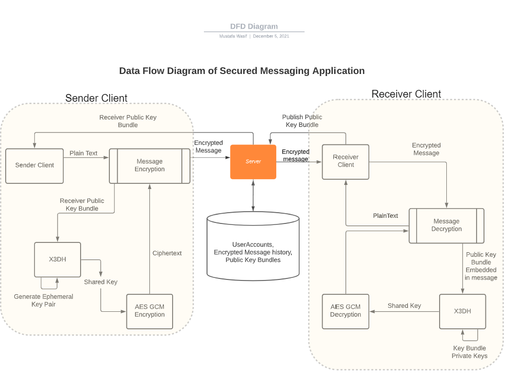

# Python CLI Secure Messaging
University of Victoria: SENG 360 Assignment 3 - Security Specification and Implementation  
**Python CLI Secure Messaging: version 1.0** - last updated: December 6, 2021

Group 30:

Rodrigo Honghe, V00903001;  
Mustafa Wasif, V00890184;  
Raphael Bassot, V00896541

## About The Project
**Python CLI Secure Messaging** is a fast, secure command-line based chat application built entirely in Python. Chats are performed in real-time between two clients who establish a shared connection. This project follows a client-server model, where the running server acts as an intermediary to service all clients.


Every client and server runs in a multi-threaded environment leveraging Python's *threading* module. Once logged into the system, a running client spawns a sender thread and a receiver thread, to handle sending requests and receiving responses respectively. To handle multiple clients, the server spawns a new thread dedicated to each client connection established over a TCP socket. Concurrency allows each client and the main server to perform multiple tasks at once, and achieve proper synchronization between tasks.

The following features are included with this application:
- 1:1 real-time chat messaging
- text messages
- image messages
- reliable message histories (while a user session stays open)
- images retrieved from histories are organized in the client's filesystem
- account registration & deletion

Python CLI Secure Messaging achieves the following security features:
- message integrity is assured
- users authenticate with each other before chatting
- perfect forward secrecy is maintained
- end-to-end encryption is maintained
- at-rest encryption is maintained
- users can deny having sent a message (deniability)
- password inputs for the application are hidden from view for privacy

The implemented encryption methods and protocols are discussed in detail below: [Encryption Implementations](#encryption-implementations).

## Design Implementations
### File Structure
The repository is partitioned into two subdirectories: `/python/client`, and `/python/server`. Each subdirectory implements the large majority of functionality for each of the system's entities. The file structure of the repository can be seen below:

```
seng360-a3 (root)
│   README.md
│   python-sm.db    
│   __init__.py
│
└───python
    │   __init__.py
    │
    └───client
    │   │   __init__.py
    │   │   ClientSendThread.py
    │   │   ClientRecvThread.py
    │   │   encryption.py
    │   │   sm_client.py
    │   │   config.py
    │   
    └───server
        │   __init__.py
        │   ServerThread.py
        │   DatabaseConnection.py
        │   sm_server.py
        │   config.py
```

### The Server
The server implementation starts by running `sm_server.py`. This starts a continuous main server loop to accept any new client connections over Port 50007. To handle new clients that connect, the main server thread delegates this client's connection to an instance of the ServerThread class (a subclass of `threading.Thread`), which accepts all future requests from the client it is dedicated to, and returns appropriate responses. This implementation allows multiple client connections to be handled through concurrency at the server.

Each ServerThread handles one respective client's requests, including notifying other clients about chat initiation, forwarding messages to the correct receiver, etc. This implementation completely isolates the clients, as they never actually communicate directly, by instead relying on the server to answer requests, read from & write to the database, and forward chat messages. This central server model, as well as the database adapter and some encryption steps, can be seen in our Data Flow Diagram below:

#### DFD Diagram



For data persistence, ServerThread instances query the SQLite3 database - stored at `python-sm.db` in the repository -  through their `.db_conn` object (of type sqlite3.Connection). This allows them to store information into one of the four database tables for the application, as well as retrieve any required information. Read-access to the database is only permitted from the server side of the application. The persisting `.db` file is regenerated automatically at every start up of the server.

The four database tables accessible to the server are:
- `Account(id, first_name, last_name, username, password)`: a table to hold user accounts for the application. Used to verify against registered accounts.
- `Message(owned_username, send_username, recv_username, encr_message)`: a table to hold all messages that have passed through the running server, regardless of which client it was sent from/intended for. Messages are stored *twice* per sent message - once for the chat's sender, once for the receiver - to differentiate between the conversation history of each user.
- `KeyBundle(username, IdentityKey, EdwardsKey, SignedPrekey, Signature)`: a table to hold each user's public key bundle.
- `OTPK(username, OneTimePrekey)`: a table to hold each user's set of One-time Prekeys.

Finally, when clients logout of the system or close the application entirely, the ServerThread for that client is notified and is terminated, and performs cleanup of the user's session (including deleting that user's message history) prior to exiting.

### The Client
Client implementations start by running `sm_client.py`. This initializes a TCP socket connection to the server running at Port 50007. A login menu first prompts the user, where they can login to an existing account, register a new account, or exit. When a client logs into an account, the main client thread spawns two new threads - ClientSendThread and ClientRecvThread, each one a subclass of `threading.Thread` - which takeover the execution of the client-side application. The SendThread works to receive user input continuously, and send requests over the socket connection to the listening ServerThread associated to that client. The RecvThread listens to the ServerThread to receive incoming responses, and parses the data as expected.

To enter a new chat with another client, both of the threads (SendThread & RecvThread) from each of the participating clients must synchronize properly to wait for chat confirmation, and enter the chat at the same time. Essentially, when the application scope changes to enter a chat, both of that clients' threads should now be ready to send messages and listen for messages coming from the server. To achieve this, thread synchronization was performed via a shared `threading.Event()` object in the client-side `config.py` file. This file acts as a global environment where the Send & Recv threads for one client can share information. In this case, one thread can block on the `Event()` object until the other thread releases it, allowing both threads to enter the chat at the same time.

Finally, all program exit cases - logout, account deletion, and application exit - are handled gracefully, where the server is notified and the connection is closed without error. During any of the above scenarios, the user's session is considered closed, which means they can no longer view prior message histories. On logout, the application terminates both the ClientSendThread and ClientRecvThread, and scope returns to the client's main thread, which includes the initial login menu.

## Encryption Implementations
### Message Encryption Overview
To achieve end-to-end encryption with perfect forward secrecy we've implemented a derivation of Signal Protocol [[1]](https://en.wikipedia.org/wiki/Signal_Protocol). This application uses the Extended Triple Diffie-Hellman (X3DH) to derive a shared key between two users and then encrypts messages using an AEAD encryption scheme (AES-GCM) with the derived shared key. We chose X3DH due to its deniability property, X3DH doesn't give either Alice or Bob a publishable cryptographic proof of the contents of their communication or the fact that they communicated [[2]](https://signal.org/docs/specifications/x3dh/). This [section](#x3dh) explains the scenario where Alice wants to send Bob a message.

### <a name="x3dh"></a> X3DH Key Agreement Protocol [[2]](https://signal.org/docs/specifications/x3dh/)
X3DH (or "Extended Triple Diffie-Hellman") key agreement protocol establishes a shared secret key between two parties who mutually authenticate each other based on public keys. 
The protocol has three phases:
1. Bob publishes his identity key and prekeys to a server.
2. Alice fetches Bob's "prekey bundle" from the server, and uses it to send a message.
3. Bob receives and processes Alice's message.

#### Generating Keys
All keys generated are based on the elliptic curve _Curve25519_. Upon login, `encryption` generates the following key pairs (public and secret keys):
- Identity Key (`IK`)
- Edwards Key (`ED`)
- Signed Prekey (`SPK`)
- Signature (`Sig`) -> value from signing SPK using secret Edwards Key
- One-time Prekey (`OTPK`)

Once the keys are generated, public `IK`, `ED`, `SPK`, and `Sig` are bundled together and sent to the database to be stored. One-hundred `OTPK`s are generated at a time and stored separately from the key bundle. A single run of X3DH uses one `OTPK`, the `OTPK` used is promptly discarded. New `OTPK`s are generated only if the previous ones have already been used.

The `IK`, `SPK`, and `OTPK` key pairs are generated using `X25519` from [`cryptography`](https://cryptography.io/en/latest/hazmat/primitives/asymmetric/x25519/). The `ED` key is used for signatures and is generated using `Ed25519`, also from [`cryptography`](https://cryptography.io/en/latest/hazmat/primitives/asymmetric/ed25519/).


#### Calculating Shared Key
After fetching Bob's key bundle and One-time prekey from the server, Alice verifies Bob's `SPK` using the `Signature` and `ED` from the key bundle. Once verified, Alice generates an Ephemeral key pair (`EK`) and then calculates the shared key (`SK`) as follows: 
1. `DH1 = DH(Alice's Secret IK, Bob's Public SPK)`
2. `DH2 = DH(Alice's Secret EK, Bob's Public IK)`
3. `DH3 = DH(Alice's Secret EK, Bob's Public SPK)`
4. `DH4 = DH(Alice's Secret EK, Bob's Public OTPK)`


`SK = HKDF(F || DH1 || DH2 || DH3 || DH4)`

Where the `HDFK` is an HMAC-based Extract-and-Expand Key Derivation Function, i.e. a fixed cost algorithm Key Derivation Function. The value of `F` is 32 bytes of `0xFF` as per the [protocol definition](https://signal.org/docs/specifications/x3dh/#cryptographic-notation).


#### Encrypting Message
After calculating the shared key, Alice calculates a key combination and signs it along with message contents. Alice then builds a payload and encrypts it using the AES-GCM encryption scheme. Once the message is encrypted, Alice deletes her shared key and DH outputs before sending Bob the `Final Message`.

```
Key Combination = Alice Public IK + Alice Public EK + Bob OTPK

Signature = value from signing Key Combination and Message using secret Edwards Key

Payload = Signature + Alice Public IK + Bob Public IK + Message

nonce = 12-bytes, randomly generated

Ciphertext, tag = AESGCM(SK, nonce, payload)

Final Message = Key Combination + nonce + tag + Ciphertext 
```

The size of the `Final Message` is at least 124 bytes, see below

```
IK, EK, OTPK = 32 bytes
nonce = 12 bytes
tag = 16 bytes

Final Message = IK_a + EK_a + OTPK_b + nonce + tag + Ciphertext
                32   + 32   + 32     + 12    + 16  + len(Ciphertext)
```


#### Decrypting Message
Upon receiving the message, Bob fetches Alice's key bundle from the server and verifies the message contents for integrity. First, Bob extracts information from the received message as follows:

```
Key Combination = received_msg[0:96]
Message IK = received_msg[0:32]
Message EK = received_msg[32:64]
Message OPTK = received_msg[64:96]
nonce = received_msg[96:108]
tag = received_msg[108:124]
ciphertext = received_msg[124:]
```

Next, Bob uses the `Message OTPK` (Bob's public `OTPK` used by Alice) to find his `Secret OTPK`. If the `Secret OPTK` isn't found, Bob rejects the message. Otherwise, Bob applies the X3DH protocol and calculates his shared key as follows:

1. `DH1 = DH(Bob's Secret SPK, Message IK)`
2. `DH2 = DH(Bob's Secret IK, Message EK)`
3. `DH3 = DH(Bob's Secret SPK, Message EK)`
4. `DH4 = DH(Bob's Secret OTPK, Message EK)`

`SK = HDKF(F || DH1 || DH2 || DH3 || DH4)`

After calculating the shared key, Bob tries to decrypt the ciphertext. If unsuccessful Bob will stop the decryption and delete the calculated `SK` and DH outputs. Otherwise, Bob verifies the `Key Combination` and `Message` with the payload's `Signature` and `Public ED` from Alice's key bundle. If the verification fails Bob rejects the message, otherwise, accepts it.

### Password Encryption
At the registration phase, passwords are hashed using SHA-256. A 16-byte salt is randomly generated and then appended to the hashed password before being stored in the database. 

At login, the password type is used to calculate a new hash. Users are authenticated by comparing the database hash to the one calculated at login. If the hashes are equal, the login is successful. Otherwise, the login fails.


## Getting Started
### Dependencies
Python version 3.8+ was used for development of this application, and is suggested to be used for correct program behaviour.

Multiple Python libraries were used to achieve the functionality of this program. The following dependencies must be installed via *pip*:
- Python Standard Library
- cryptography
- Pillow (PIL)
- termcolor

### Running `sm_server.py`
The server runs on Port 50007, and must be started first to initiate the program.
1. From the root of the repository, run the following command in a terminal:
`python python/server/sm_server.py`

### Running `sm_client.py`
Clients run on their own distinct Port numbers, and each in their own terminal window. They can be started once a server is running.

2. From the root of the repository, run the following command in a different terminal:
`python python/client/sm_client.py`

3. Repeat Step 2 in new terminals to start more new clients.

4. From here, application menus provide detailed descriptions of features accessible to each client user. In most menus, users have the option to display all present options that they have from a specific menu. This can be shown with the following command at the user's in-application command prompt:
`--options`

### <a name="quitting-the-program"></a> Quitting the program
Clients can individually logout and quit the program via in-application commands.
The server runs indefinitely and must be killed externally from another program, to free up Port 50007 from the running server process. An example of a command to achieve this (in Windows) is:
`npx kill-port 50007`

## Known Bugs
There are active known bugs in this program that require additional work to be resolved. This list describes, in order of descending importance to the program, all active bugs in the application:

- We are considering a **user session** to be between the time that a user logs into their account, to the time that a user logs out or terminates the client program in any way. This is considered due to the fact that outside of a user session, a client has no way of decrypting their message histories from prior sessions that are stored on the server. The reasoning behind this is due to the nature of this X3DH implementation, where Alice's identity key, Edwards key, and signed pre-key are all regenerated by her threads upon every login of her account, and no state saving was possible for these keys upon logout. We decided against storing these long-term keys in a client's own database, as it appears to be dangerous practice that could lead to side-channel attacks. A better implementation for maintaining these private keys requires more thought and additional work.
- Rejecting a chat request coming from another client (i.e. responding 'N') has not yet been handled properly, and therefore currently all chat requests must be accepted.
- No duplicate session checking was implemented on the server side, which means two different clients could potentially log into the same user account. This case must be avoided in this version of the application.
- Once the server is terminated, re-logging into an account can end up locking the server's database, as it may not be properly cleaned up once the server stops. Therefore, every time the server is terminated, the `python-sm.db` database file should also be deleted (it is regenerated at every server launch).
- There is no graceful way of terminating the running server from inside the application - it must externally terminated as explained in the previous section: [Quitting The Program](#quitting-the-program).

## Acknowledgements
Great thanks to our UVic SENG360 professor, Jens Weber, for answering our numerous questions about the project and providing helpful guidance when we needed it most.
